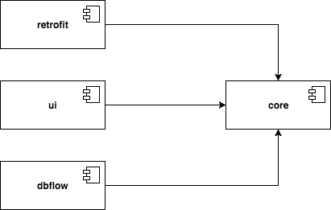

# BigBang

[](https://circleci.com/gh/xmartlabs/Android-Base-Project)
[](https://codebeat.co/projects/github-com-xmartlabs-android-base-project-master)
[](https://bintray.com/xmartlabs/Android-Base-Project/Core/_latestVersion)
[](https://bintray.com/xmartlabs/Android-Base-Project/DbFlow/_latestVersion)
[](https://bintray.com/xmartlabs/Android-Base-Project/Retrofit/_latestVersion)
[ ](https://bintray.com/xmartlabs/Android-Base-Project/CrashlyticsLogger/_latestVersion)

This is [Xmartlabs](https://xmartlabs.com) Android base project. Architecturally composed of a set of libraries for building modern and scalable applications from the ground up.
<br>The BigBang of our Android projects.

Our architecture divides the typical layers of an Android application into simple coherent modules, which are completely independent from one another:
* UI
* Services
* Database
* Crashlytics Logger

In order to keep modules independent, we decoupled the behavior required for each layer into a single module, where everything comes together smoothly, which we call `core`. This not only allows you to choose which modules to use, but also gives you independence from any service or database oriented libraries we use.

Learn more about the project on the [BigBang Wiki](https://github.com/xmartlabs/bigbang/wiki) or by reading the Javadocs.

## Getting started

The first step is to include the Core library into your project as a Gradle compile dependency:

```groovy
compile 'com.xmartlabs.bigbang:core:0.1.54'
```

Then, add jCenter to the buildscript repositories:

```groovy
buildscript {
    repositories {
        jcenter()
    }
}
```

Also, you'll need to add the following repositories:

```groovy
repositories {
    flatDir {
        dirs 'libs'
    }
    maven { url "https://jitpack.io" }
    maven { url 'https://maven.fabric.io/public' }
    maven { url "https://oss.sonatype.org/content/repositories/snapshots/" }
}
```

Then, include any of the following compile dependencies to add an specific module to your app:
```groovy
compile 'com.xmartlabs.bigbang:dbflow:0.1.54'
compile 'com.xmartlabs.bigbang:log-crashlytics:0.1.54'
compile 'com.xmartlabs.bigbang:retrofit:0.1.54'
compile 'com.xmartlabs.bigbang:ui:0.1.54'
```

The `dbflow` module is database related, while the `retrofit` module is service related.

## Architecture

<p align="center">
    
</p>

There are four main components. The `core` component exposes the 
interfaces needed to implement a certain type of service, like database or network related.
Thus, the `core` component should always be included in any project that makes use of this
architecture.

A component should encapsulate and provide a single functionality. If the component belongs to a certain category of services (like networking or database), then the functionality
should be specified and described in the core component.

## Project template

In order to start using the modules, you'll need to set up a few things, which are well
explained in their respective Wiki. Therefore, to start a new project, we provide a
template, which consists of the minimal setup required to get you going.
You will find that in the `template` module.

## Style guide

We strictly follow [our style guide](https://github.com/xmartlabs/Android-Style-Guide), which extends from the [Google Java Style Guide](http://google.github.io/styleguide/javaguide.html) but with some modifications. Please remember to follow it when contributing to this project.

## Bugs and Feedback

When submitting code, please make every effort to follow existing conventions and style in order to keep the code as readable as possible. Please also make sure your code compiles and try to cover your code with tests.
<br><b>We welcome contributors!</b>

For bugs, issues, feature requests, questions and discussions please use the [Github Issues](https://github.com/xmartlabs/bigbang/issues).

## Authors

* [Santiago Castro](https://github.com/bryant1410)
* [Miguel Revetria](https://github.com/m-revetria)
* [Matías Irland](https://github.com/matir91)
* [Michael Ellis](https://github.com/michaelEllisUy)
* [Diego Medina](https://github.com/diegomedina248)
* [Santiago Casas](https://github.com/chacaa)

## Changelog

This can be found in the [CHANGELOG.md](CHANGELOG.md) file.


